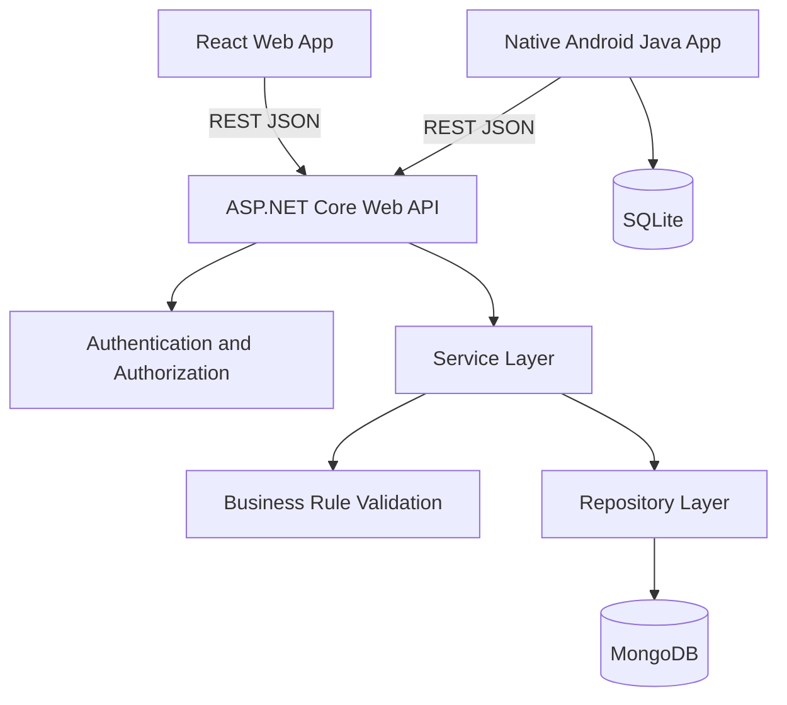
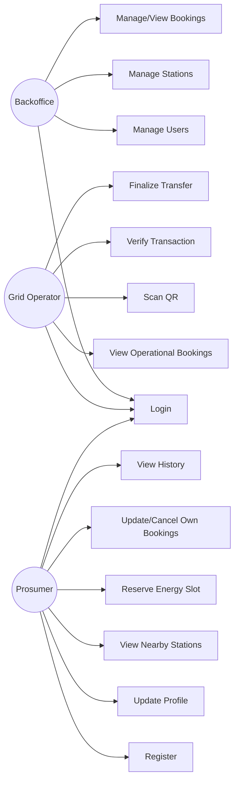
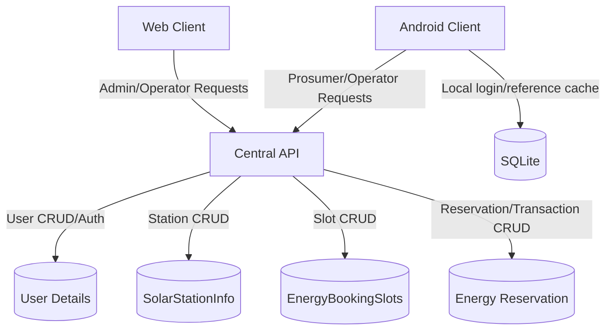
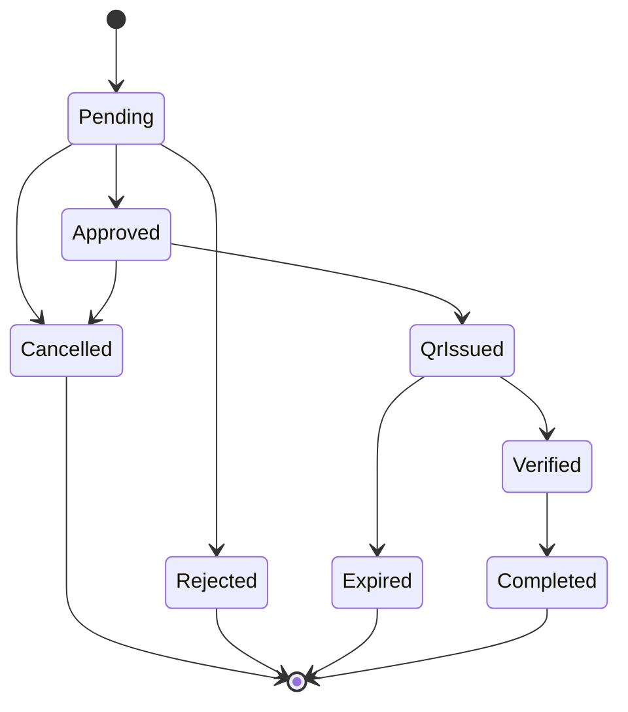
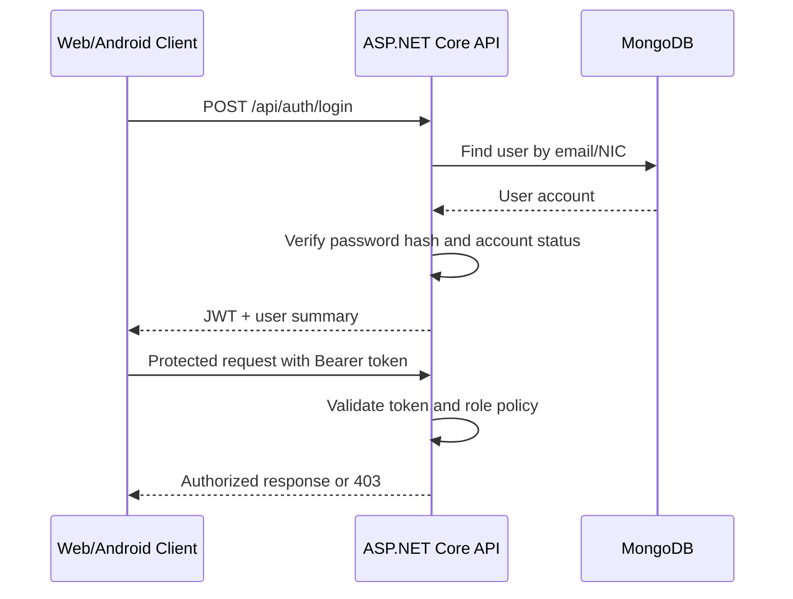

# Phase 1 Architecture and Analysis Diagrams

These Mermaid diagrams can be pasted into the report or rendered by Markdown tools that support Mermaid.

## System Architecture

## Use Case Diagram

## Level 0 DFD

## Reservation State Model

## Authentication Flow

