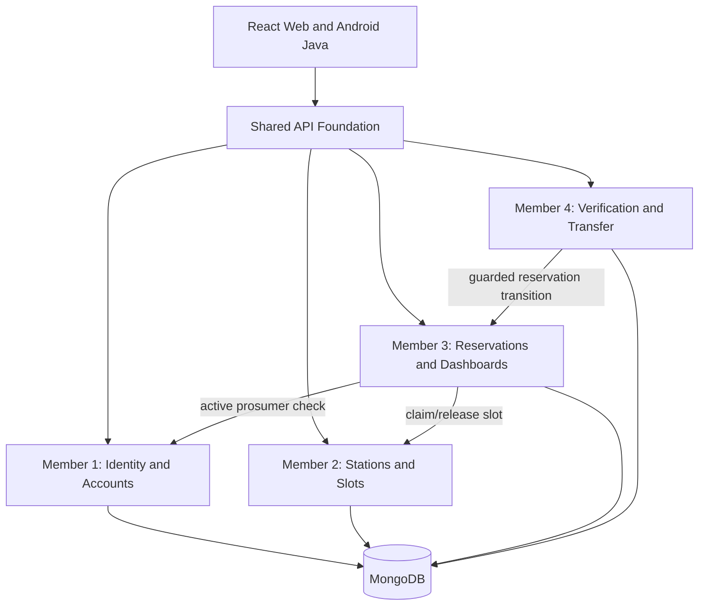
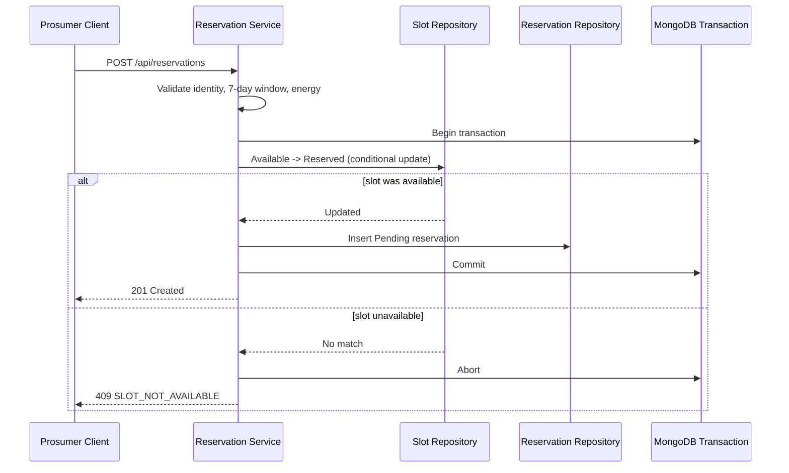
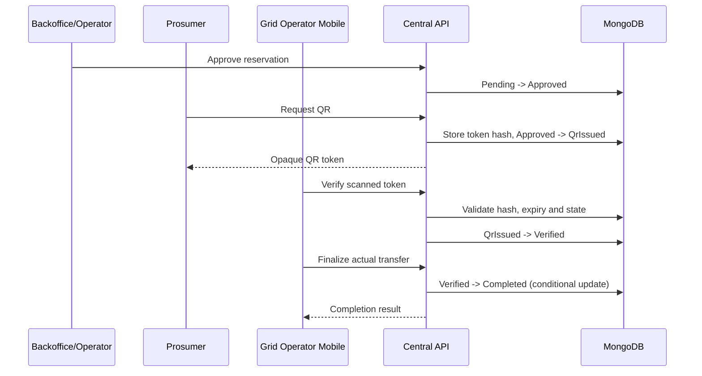
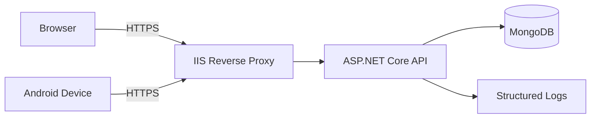

# Phase 2 Architecture Diagrams

## Component Ownership

```mermaid
flowchart TB
    Clients[React Web and Android Java]
    Foundation[Shared API Foundation]
    M1[Member 1: Identity and Accounts]
    M2[Member 2: Stations and Slots]
    M3[Member 3: Reservations and Dashboards]
    M4[Member 4: Verification and Transfer]
    DB[(MongoDB)]

    Clients --> Foundation
    Foundation --> M1
    Foundation --> M2
    Foundation --> M3
    Foundation --> M4
    M3 -->|active prosumer check| M1
    M3 -->|claim/release slot| M2
    M4 -->|guarded reservation transition| M3
    M1 --> DB
    M2 --> DB
    M3 --> DB
    M4 --> DB
```

## Reservation Creation Consistency

```mermaid
sequenceDiagram
    participant P as Prosumer Client
    participant API as Reservation Service
    participant S as Slot Repository
    participant R as Reservation Repository
    participant DB as MongoDB Transaction

    P->>API: POST /api/reservations
    API->>API: Validate identity, 7-day window, energy
    API->>DB: Begin transaction
    API->>S: Available -> Reserved (conditional update)
    alt slot was available
        S-->>API: Updated
        API->>R: Insert Pending reservation
        API->>DB: Commit
        API-->>P: 201 Created
    else slot unavailable
        S-->>API: No match
        API->>DB: Abort
        API-->>P: 409 SLOT_NOT_AVAILABLE
    end
```

## QR Verification and Transfer

```mermaid
sequenceDiagram
    participant B as Backoffice/Operator
    participant P as Prosumer
    participant O as Grid Operator Mobile
    participant API as Central API
    participant DB as MongoDB

    B->>API: Approve reservation
    API->>DB: Pending -> Approved
    P->>API: Request QR
    API->>DB: Store token hash, Approved -> QrIssued
    API-->>P: Opaque QR token
    O->>API: Verify scanned token
    API->>DB: Validate hash, expiry and state
    API->>DB: QrIssued -> Verified
    O->>API: Finalize actual transfer
    API->>DB: Verified -> Completed (conditional update)
    API-->>O: Completion result
```

## Deployment

```mermaid
flowchart LR
    Browser[Browser] -->|HTTPS| IIS[IIS Reverse Proxy]
    Android[Android Device] -->|HTTPS| IIS
    IIS --> API[ASP.NET Core API]
    API --> Mongo[(MongoDB)]
    API --> Logs[Structured Logs]
```
