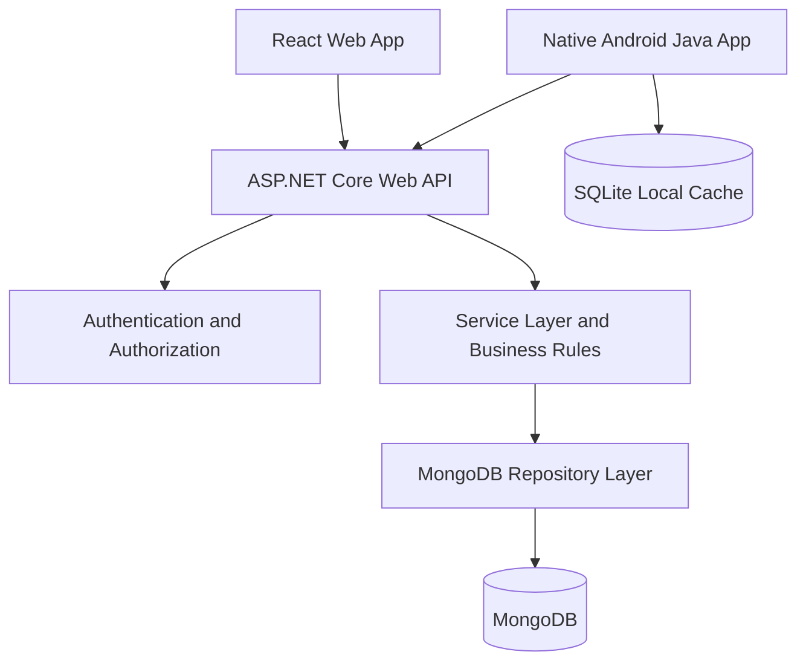
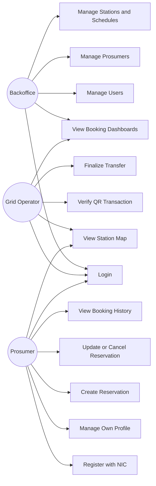
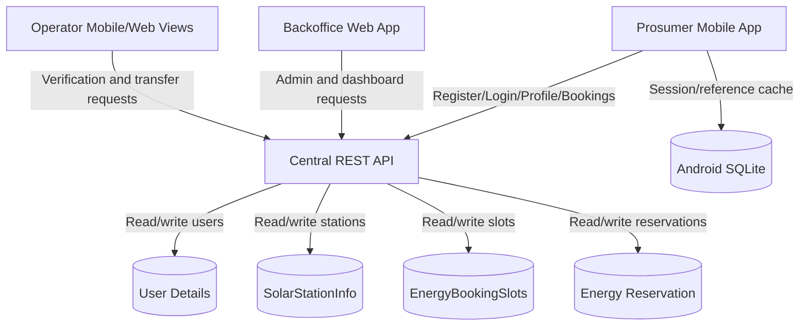

# SE4040 Phase 1 - Requirements Analysis and Project Foundation

Project: Smart Solar Microgrid Trading System  
Prepared for: Phase 1 - Requirements Analysis and Project Foundation  
Primary Member 1 scope: Identity, Authentication and Account Management  
Source references: `docs/references/EAD_SE4040_Assignment_2026.pdf` and `docs/references/Smart_Solar_Microgrid_Trading_System-plan.md`

## 1. Phase 1 Objective

Phase 1 establishes the agreed project foundation before implementation. The central decision is to build one ASP.NET Web API that owns business logic and MongoDB persistence, with React and native Android clients consuming the API through REST endpoints.

Phase 1 is complete when the team has agreed on:

- Functional and non-functional requirements.
- Actors, roles, permissions and account lifecycle rules.
- System architecture and client/API/database boundaries.
- MongoDB collections and key status values.
- API endpoint catalogue and ownership.
- Team responsibility matrix.
- Assignment-to-feature traceability.
- UI and evidence checklist.
- Finalized decision log for ambiguous rules.
- Initial use case, DFD and Phase 2 implementation plan.

## 2. Project Decisions

| Area | Decision |
| --- | --- |
| Backend | C# ASP.NET Core Web API |
| Architecture style | FAT Service pattern |
| Database | MongoDB |
| Web client | React.js with Tailwind CSS |
| Mobile client | Native Android using Java |
| Mobile local persistence | SQLite |
| Hosting | Windows IIS |
| Repository style | Monorepo |
| Business logic authority | Central API only |
| Required core collections | User details, SolarStationInfo, EnergyBookingSlots, Energy Reservation |

## 3. Actors

| Actor | Description |
| --- | --- |
| Backoffice User | Administrative web user who manages system users, prosumers, stations, schedules and operational records. |
| Grid Operator | Operational user who monitors bookings, verifies QR transactions and finalizes energy transfers. |
| Solar Prosumer | Mobile user who registers with NIC, manages profile data, views stations, creates reservations and tracks booking history. |
| System/API | Central REST API that validates identities, permissions, rules and data persistence. |

## 4. Functional Requirements

| ID | Requirement | Primary Owner | Client Surface |
| --- | --- | --- | --- |
| FR-01 | Authenticate Backoffice, Grid Operator and Prosumer users through the API. | Member 1 | Web, Android |
| FR-02 | Register a Prosumer account using NIC as the primary identity. | Member 1 | Android, API |
| FR-03 | Store hashed passwords and never persist plaintext credentials. | Member 1 | API |
| FR-04 | Enforce role-based authorization on every protected endpoint. | Member 1 | API |
| FR-05 | Allow authorized users to create, view, update, deactivate and reactivate accounts. | Member 1 | Web, API |
| FR-06 | Allow Prosumers to view and update only their own profile. | Member 1 | Android, API |
| FR-07 | Persist mobile login/session reference data in SQLite as required by the assignment. | Member 1 | Android |
| FR-08 | Manage solar station information including GPS location, capacity, schedules and status. | Member 2 | Web, Android, API |
| FR-09 | Manage energy booking slots and availability. | Member 2 | Web, Android, API |
| FR-10 | Prevent station deactivation when active reservations exist. | Member 2 | API |
| FR-11 | Allow Prosumers to create reservations for available slots. | Member 3 | Android, API |
| FR-12 | Enforce reservation scheduling within the permitted 7-day window using server time. | Member 3 | API |
| FR-13 | Enforce the 12-hour update/cancellation notice rule using server time. | Member 3 | API |
| FR-14 | Provide booking history, pending bookings and summary/dashboard views. | Member 3 | Web, Android, API |
| FR-15 | Generate secure QR transaction data for approved reservations. | Member 4 | API, Android |
| FR-16 | Allow Grid Operators to scan and verify QR transactions. | Member 4 | Android, API |
| FR-17 | Finalize energy transfers only after valid server-side transaction verification. | Member 4 | Android, API |
| FR-18 | Prevent invalid, expired, unauthorized or duplicate transaction completion. | Member 4 | API |
| FR-19 | Display nearby grid nodes and station details using map features. | Member 2/4 | Android |
| FR-20 | Provide consistent error responses for validation, authentication and authorization failures. | Member 1 | API, Web, Android |

## 5. Non-Functional Requirements

| ID | Requirement |
| --- | --- |
| NFR-01 | The API must be the single source of truth for authentication, authorization and business rules. |
| NFR-02 | Web and Android clients must never connect directly to MongoDB. |
| NFR-03 | API responses must use a consistent JSON envelope for success and error states. |
| NFR-04 | Sensitive configuration such as MongoDB connection strings, JWT signing keys and map keys must not be committed. |
| NFR-05 | Passwords must be hashed using a strong one-way algorithm. |
| NFR-06 | All protected API endpoints must require authentication and role checks. |
| NFR-07 | Server-side timestamps must be stored in UTC. Clients may display local time. |
| NFR-08 | Android must use SQLite for required local login/reference persistence, not as a replacement for server data. |
| NFR-09 | The deployed API must be hosted on IIS and reachable by both clients. |
| NFR-10 | The system must show graceful client errors when the API is unavailable or rejects a request. |
| NFR-11 | The project must include evidence: screenshots, API responses, database records, tests, source code and contribution notes. |

## 6. Roles and Permissions

| Capability | Backoffice | Grid Operator | Prosumer |
| --- | --- | --- | --- |
| Login | Yes | Yes | Yes |
| Register as Prosumer | No | No | Yes |
| Manage web users | Yes | No | No |
| Manage prosumer accounts | Yes | Read operational identity summary only | Own account only |
| Deactivate/reactivate accounts | Yes | No | Request own deactivation through profile flow |
| Manage stations and schedules | Yes | View operational station data | No |
| View nearby stations | No | Yes | Yes |
| Create reservation | No | No | Yes |
| Update/cancel own reservation | No | No | Yes |
| View booking dashboards | Yes | Yes | Own history only |
| Verify QR transaction | No | Yes | No |
| Finalize energy transfer | No | Yes | No |

## 7. Account Lifecycle

Recommended account statuses:

- `PendingActivation`
- `Active`
- `Deactivated`
- `Rejected`

Rules:

- New Backoffice and Grid Operator accounts are created by an authorized Backoffice user.
- New Prosumer accounts are created through Android registration using NIC as the primary identity.
- A deactivated account cannot login.
- A Prosumer can update only their own profile.
- Backoffice can reactivate eligible Prosumer accounts.
- Account status changes must be recorded with timestamp and actor information where practical.

## 8. System Architecture

The system uses a FAT Service API. React and Android handle presentation, input collection and user feedback. The API handles validation, authorization, workflows, business rules and persistence.



Architecture rules:

- Clients call the API only.
- MongoDB is reachable only from the API.
- Reservation, QR, account status and role rules are enforced server-side.
- SQLite stores required local Android login/reference data only.

## 9. Initial Use Case Diagram



## 10. Initial DFD



## 11. MongoDB Collection Design Summary

Detailed collection design is maintained in `docs/database-design/mongodb-collections.md`.

| Collection | Owner | Purpose |
| --- | --- | --- |
| `users` | Member 1 | Backoffice, Grid Operator and Prosumer identity/account records. |
| `solarStationInfo` | Member 2 | Microgrid node profile, GPS location, capacity and operational status. |
| `energyBookingSlots` | Member 2 | Bookable station energy slots and availability state. |
| `energyReservations` | Member 3/4 | Reservation lifecycle, QR transaction metadata and transfer completion state. |

Key shared decisions:

- Prosumer NIC is unique and used as the prosumer-facing primary identity.
- MongoDB `_id` may still exist as the technical document identifier.
- Store cross-collection references consistently, for example `prosumerNic`, `stationId`, `slotId` and `reservationId`.
- Store timestamps in UTC.

## 12. API Endpoint Catalogue Summary

Detailed endpoint contracts are maintained in:

- `docs/api-contracts/identity-api.md`
- `docs/api-contracts/station-slot-api.md`
- `docs/api-contracts/reservation-dashboard-api.md`
- `docs/api-contracts/operator-transaction-api.md`

| Module | Example Endpoints | Owner |
| --- | --- | --- |
| Auth | `POST /api/auth/login`, `POST /api/auth/logout`, `GET /api/auth/me` | Member 1 |
| Users | `POST /api/users`, `GET /api/users`, `PATCH /api/users/{id}/status` | Member 1 |
| Prosumers | `POST /api/prosumers/register`, `GET /api/prosumers/me`, `PUT /api/prosumers/me` | Member 1 |
| Stations | `POST /api/stations`, `GET /api/stations`, `PUT /api/stations/{id}` | Member 2 |
| Slots | `POST /api/stations/{stationId}/slots`, `GET /api/stations/{stationId}/slots` | Member 2 |
| Reservations | `POST /api/reservations`, `GET /api/reservations/me`, `PUT /api/reservations/{id}` | Member 3 |
| Dashboards | `GET /api/dashboard/bookings`, `GET /api/dashboard/summary` | Member 3 |
| Transactions | `POST /api/reservations/{id}/qr`, `POST /api/transactions/verify`, `POST /api/transactions/finalize` | Member 4 |

## 12.1 Requirement Traceability

Full requirement mapping is maintained in `docs/requirements/requirements-traceability-matrix.md`.

That matrix maps each requirement to:

- Feature owner.
- API contract.
- Database collection.
- Web surface.
- Android surface.
- Evidence to capture.

## 13. API Response Convention

Success response:

```json
{
  "success": true,
  "message": "Request completed successfully.",
  "data": {}
}
```

Error response:

```json
{
  "success": false,
  "message": "Validation failed.",
  "errors": [
    {
      "field": "email",
      "message": "Email is required."
    }
  ]
}
```

Recommended HTTP status use:

- `200 OK` for successful read/update.
- `201 Created` for successful creation.
- `400 Bad Request` for validation failures.
- `401 Unauthorized` for missing/invalid authentication.
- `403 Forbidden` for authenticated users without permission.
- `404 Not Found` for missing records.
- `409 Conflict` for duplicate NIC/email or invalid state conflicts.
- `500 Internal Server Error` for unexpected failures.

## 14. Team Responsibility Matrix

| Member | Feature Domain | Backend | Web | Android | Evidence |
| --- | --- | --- | --- | --- | --- |
| Member 1 | Identity, Authentication and Account Management | Users, auth, roles, profile APIs | Login, role routing, user/prosumer management | Registration, login, profile, SQLite login reference | Auth endpoints, role tests, account screenshots |
| Member 2 | Microgrid Nodes and Energy Slots | Station and slot APIs | Station and schedule management | Nearby stations, station details, maps | Station records, map screenshots |
| Member 3 | Reservations and Dashboards | Reservation rules, history, dashboard APIs | Booking views and filters | Reservation create/update/cancel/history | 7-day and 12-hour test evidence |
| Member 4 | Operator Verification and Energy Transfer | QR verification and finalization APIs | Operator dashboard | QR scanning and transfer completion | QR success/failure evidence |

Shared work:

- API conventions: Member 1 primary, Member 3 reviewer.
- MongoDB conventions: Member 2 primary, all reviewers.
- IIS deployment: Member 4 primary, Member 1 reviewer.
- Report structure: Member 3 primary, all reviewers.
- Final integration testing: Member 4 primary, all reviewers.

## 15. Phase 1 Acceptance Checklist

| Deliverable | Status |
| --- | --- |
| Requirements specification | Completed in this document |
| Functional requirements checklist | Completed |
| Non-functional requirements checklist | Completed |
| User roles and permissions matrix | Completed |
| System architecture diagram | Completed |
| Initial use case diagram | Completed |
| Initial DFD | Completed |
| Database collection design | Completed in `docs/database-design/mongodb-collections.md` |
| API endpoint catalogue | Completed with identity details in `docs/api-contracts/identity-api.md` |
| Team ownership document | Completed |
| Member 1 scope definition | Completed in `docs/phase-1/member-1-identity-scope.md` |
| Full requirement traceability matrix | Completed in `docs/requirements/requirements-traceability-matrix.md` |
| Station and slot API contract | Completed in `docs/api-contracts/station-slot-api.md` |
| Reservation and dashboard API contract | Completed in `docs/api-contracts/reservation-dashboard-api.md` |
| Operator transaction API contract | Completed in `docs/api-contracts/operator-transaction-api.md` |
| UI and evidence checklist | Completed in `docs/phase-1/ui-and-evidence-checklist.md` |
| Decision log | Completed in `docs/phase-1/decision-log.md` |

## 16. Phase 2 Implementation Plan

1. Create the ASP.NET Core Web API project under `backend/SmartSolarMicrogrid.Api`.
2. Configure MongoDB settings through environment-specific configuration.
3. Implement common response envelope, exception middleware and validation conventions.
4. Implement Member 1 identity foundation first: user model, password hashing, JWT authentication and role policies.
5. Implement station and slot models after the identity base is available.
6. Implement reservation rules and dashboards against the agreed status model.
7. Implement transaction verification and QR finalization.
8. Begin React and Android client screens once each API contract is stable.
9. Verify each feature with API requests, MongoDB records and UI screenshots.
