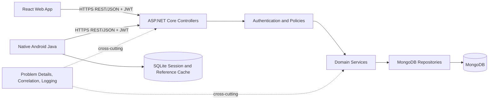

# Phase 2 - Architecture, Database and API Contracts

Status: Complete design and implementation baseline  
Scope: Whole system, Members 1-4  
Source of truth: Assignment requirements and the approved project plan

## 1. Phase Objective

Design and establish the central API, persistence model, integration conventions and endpoint contracts before Phase 3 feature implementation.

## 2. Technology Baseline

| Area | Decision |
| --- | --- |
| Runtime | .NET 10 LTS |
| API type | ASP.NET Core Web API with attribute-routed controllers |
| Database | MongoDB Atlas |
| Driver | Official MongoDB .NET/C# Driver 3.12.0 |
| Authentication | JWT bearer access tokens |
| Password storage | ASP.NET Core `PasswordHasher<TUser>` using PBKDF2; plaintext is never persisted or logged |
| Authorization | Role claims plus named ASP.NET Core policies |
| Validation | Data-annotation/basic shape validation at the API boundary; domain rules in services |
| Error format | RFC 7807 `ProblemDetails` with stable machine-readable error codes |
| Logging | Structured `ILogger` events with correlation IDs; secrets and credentials excluded |
| Time | UTC `DateTimeOffset` values ending in `Utc`; clients convert for display |
| API version | `/api/...` is version 1 for the assignment; breaking changes require a new version |
| Deployment target | IIS for assessment deployment; MongoDB Atlas; Docker is optional for the API |

The repository pins package versions in the API project. Dependencies are upgraded deliberately by the whole team, not independently by feature owners.

## 3. Logical Architecture



The central API is the only authority for authentication, authorization, validation, reservation state, slot capacity and transfer completion. React, Android and SQLite never write directly to MongoDB.

## 4. Backend Structure

```text
backend/
  SmartSolarMicrogrid.slnx
  src/SmartSolarMicrogrid.Api/
    Authorization/       roles and policies
    Configuration/       validated settings
    Contracts/           shared API envelopes
    Controllers/         HTTP boundary only
    Infrastructure/      health and cross-cutting adapters
    Middleware/          exception/correlation behavior
    Persistence/         Mongo context and collection setup
    Domains/             Phase 3 feature modules by owner
```

Each Phase 3 domain uses `Controller -> Service -> Repository -> MongoDB`. Controllers translate HTTP input/output; services enforce workflows; repositories perform persistence only.

## 5. Authentication and Authorization

JWTs contain `sub` (MongoDB user ID), `role`, `name`, `jti`, `iss`, `aud`, `iat` and `exp`. NIC is not used as the authorization identity. Tokens expire after 60 minutes. Deactivated accounts are rejected at login and must also be checked for sensitive operations.

| Policy | Roles |
| --- | --- |
| `BackofficeOnly` | Backoffice |
| `OperatorOnly` | GridOperator |
| `ProsumerOnly` | Prosumer |
| `Staff` | Backoffice, GridOperator |

Resource ownership checks occur inside services. A valid Prosumer token alone does not permit access to another Prosumer's reservation or profile.

## 6. API Conventions

- Base content type: `application/json; charset=utf-8`.
- Public identifiers in URLs are MongoDB ObjectId strings unless the contract names a business code.
- Request DTOs end with `Request`; response DTOs end with `Response`.
- Commands use nouns and explicit action suffixes where a state transition is involved.
- Successful single-resource responses use `{ "data": ..., "message": ... }`.
- Collections use `{ "items": [...], "page": 1, "pageSize": 20, "totalCount": 0 }`.
- Default page size is 20; maximum is 100; sort order is deterministic.
- Unknown JSON fields are ignored for forward compatibility; server-managed fields are absent from request DTOs.
- `X-Correlation-ID` may be supplied by clients and is always returned by the API.
- All mutating requests are validated and authorized before persistence.

## 7. HTTP and Error Rules

| Status | Use |
| --- | --- |
| `200 OK` | Successful read, update, command or login |
| `201 Created` | New resource; include `Location` header |
| `204 No Content` | Successful command with no response body |
| `400 Bad Request` | Invalid shape, field or query value |
| `401 Unauthorized` | Missing, invalid or expired authentication |
| `403 Forbidden` | Authenticated but role/ownership disallows action |
| `404 Not Found` | Resource is absent or deliberately hidden from caller |
| `409 Conflict` | Duplicate key, stale state or business-rule collision |
| `422 Unprocessable Content` | Well-formed request violates domain validation |
| `500 Internal Server Error` | Unexpected failure; no internal details exposed |
| `503 Service Unavailable` | Readiness dependency unavailable |

Error example:

```json
{
  "type": "https://smartsolar.example/problems/reservation-state-conflict",
  "title": "Reservation state conflict",
  "status": 409,
  "detail": "Only an approved reservation can receive a QR token.",
  "instance": "/api/reservations/66f100000000000000000001/qr",
  "errorCode": "RESERVATION_INVALID_STATE",
  "traceId": "8d67f36ab98e4f13b4a7999ff7fefc77",
  "errors": {}
}
```

Stable prefixes are `AUTH_`, `USER_`, `STATION_`, `SLOT_`, `RESERVATION_`, `TRANSACTION_` and `VALIDATION_`.

## 8. Configuration and Secrets

Configuration precedence is `appsettings.json`, environment-specific settings, environment variables, then development user secrets. Production secrets are supplied by IIS/environment configuration. `.env` files, signing keys and production connection strings are never committed.

Required settings:

| Key | Purpose |
| --- | --- |
| `MongoDb__ConnectionString` | MongoDB endpoint and credentials |
| `MongoDb__DatabaseName` | Authoritative database name |
| `Jwt__Issuer` | Expected token issuer |
| `Jwt__Audience` | Expected client audience |
| `Jwt__SigningKey` | Minimum 32-byte secret |
| `Jwt__AccessTokenMinutes` | Access token lifetime |

## 9. Logging Rules

Log application startup, dependency health, authentication outcome without credentials, authorization denial, state transitions, and unhandled exceptions. Include correlation ID, authenticated user ID where available, entity ID and old/new states. Never log passwords, JWTs, QR token values, connection strings or complete request bodies containing personal data.

## 10. Member Ownership

| Member | Domain | Backend ownership | Primary collections |
| --- | --- | --- | --- |
| 1 | Identity and accounts | Auth, users, password hashing, JWT issuance, account policies | `users` |
| 2 | Stations and slots | Station/node CRUD, availability and schedules | `solarStationInfo`, `energyBookingSlots` |
| 3 | Reservations and dashboards | Booking lifecycle, rules, lists and summaries | `energyReservations`, reads from stations/slots/users |
| 4 | Verification and transfer | QR issuance/verification and final transfer | Transaction fields in `energyReservations` |

Shared foundation files require review from all members. A member may read another domain through an interface but may not duplicate or bypass its business rules.

## 11. Deliverables

- Runnable API foundation: `backend/src/SmartSolarMicrogrid.Api`.
- Atlas-connected API environment: `compose.yaml` and `.env.example`.
- Detailed database specification: `docs/phase-2/database-specification.md`.
- API governance and endpoint/client ownership: `docs/phase-2/api-contract-governance.md`.
- Architecture and workflow diagrams: `docs/architecture/phase-2-diagrams.md`.
- Four detailed endpoint contracts under `docs/api-contracts`.
- Verification and handoff guide: `docs/phase-2/verification-and-handoff.md`.

## 12. Acceptance Checklist

- [x] .NET version, project type and package baseline selected.
- [x] MongoDB driver and environment-based connection configured.
- [x] JWT authentication and role policies established.
- [x] Password hashing and secret-handling strategy established.
- [x] DTO, pagination, HTTP status and error conventions established.
- [x] Structured logging and correlation convention established.
- [x] Four required collections, relationships, indexes and consistency rules designed.
- [x] Every endpoint has owner, client, authorization and collection mapping.
- [x] Atlas API startup and verification procedure supplied.
- [ ] Team records all four approvals in `verification-and-handoff.md`.
- [x] API foundation and MongoDB readiness behavior verified against MongoDB before the Atlas migration.

The remaining team approval requires the four team members; it cannot be truthfully replaced by documentation.
