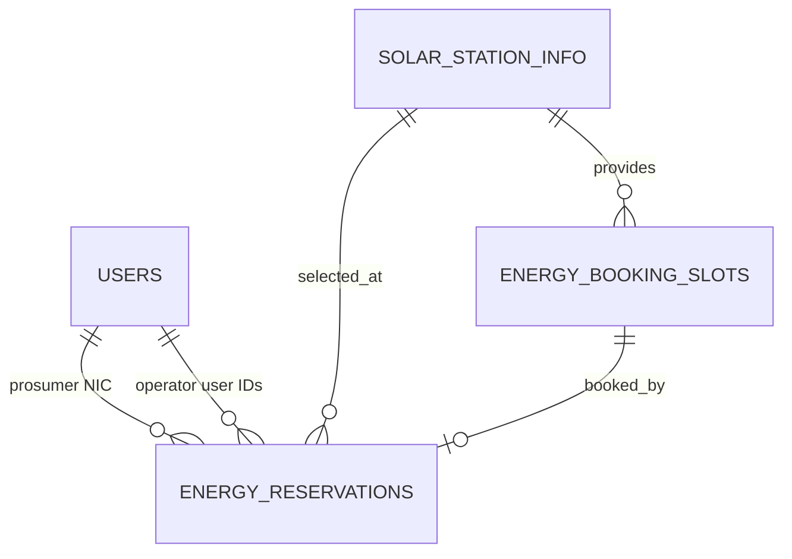

# Phase 2 MongoDB Database Specification

Platform: MongoDB Atlas

Database: `smart_solar_microgrid`

Authority: Central ASP.NET Core API only

## 1. Modelling Rules

- Keep the four assignment-required collections with their agreed names.
- Store IDs as BSON `ObjectId`; expose them as 24-character hexadecimal strings in JSON.
- Store instants as BSON UTC dates, not formatted strings.
- Store energy and price values as BSON `Decimal128` to avoid binary floating-point errors.
- Embed value objects that have no independent lifecycle, such as station location.
- Reference independently managed records by ID or the assignment-required NIC relationship.
- Keep denormalized snapshots only where historical display must survive later source edits.
- Every mutable document has `createdAtUtc` and `updatedAtUtc`.
- Repository updates use optimistic filters on expected state for workflow transitions.

## 2. Required Collections

### `users` - Member 1

Required fields: `_id`, `email`, `username`, `fullName`, `role`, `status`, `passwordHash`, `createdAtUtc`, `updatedAtUtc`.

Prosumer-only field: unique `nic`. Optional profile fields: `phoneNumber`, `address`. Staff accounts keep `nic` absent. `createdByUserId` records Backoffice creation of staff accounts.

Enums:

- `role`: `Backoffice`, `GridOperator`, `Prosumer`.
- `status`: `Active`, `Deactivated`.

Indexes:

| Name | Keys | Rule |
| --- | --- | --- |
| `ux_users_email` | `email: 1` | Unique, normalized lowercase |
| `ux_users_nic` | `nic: 1` | Unique and sparse |
| `ix_users_role_status` | `role: 1, status: 1` | User-management filtering |

### `solarStationInfo` - Member 2

Required fields: `_id`, `stationCode`, `name`, `location`, `capacityKwh`, `batteryStorageKwh`, `status`, timestamps.

`location` is embedded as GeoJSON:

```json
{
  "type": "Point",
  "coordinates": [79.8612, 6.9271],
  "address": "Colombo"
}
```

Longitude precedes latitude. Capacity values must be positive and battery storage cannot exceed the domain-approved station capacity.

Enums: `Active`, `Maintenance`, `Deactivated`.

Indexes: unique `stationCode`, `status`, and `2dsphere` on the GeoJSON `location` field.

### `energyBookingSlots` - Member 2

Required fields: `_id`, `stationId`, `startTimeUtc`, `endTimeUtc`, `availableEnergyKwh`, `pricePerKwh`, `status`, timestamps.

`stationId` references `solarStationInfo._id`. `endTimeUtc` must be after `startTimeUtc`. Available energy and price must be positive. Slots cannot overlap for the same station; exact duplicate periods are prevented by an index and overlap is checked by the service.

Enums: `Available`, `Reserved`, `Unavailable`, `Expired`.

Indexes:

| Name | Keys | Rule |
| --- | --- | --- |
| `ux_slots_station_period` | `stationId, startTimeUtc, endTimeUtc` | Unique exact period |
| `ix_slots_station_status_start` | `stationId, status, startTimeUtc` | Availability queries |

### `energyReservations` - Members 3 and 4

Required booking fields: `_id`, `reservationCode`, `prosumerNic`, `stationId`, `slotId`, `requestedEnergyKwh`, scheduled times, `status`, timestamps.

Transaction fields are nullable until their lifecycle stage: `qrTokenHash`, `qrExpiresAtUtc`, `verifiedByUserId`, `verifiedAtUtc`, `finalizedByUserId`, `finalizedAtUtc`, `actualEnergyTransferredKwh`. Store only a cryptographic hash of the opaque QR token.

Enums: `Pending`, `Approved`, `Rejected`, `Cancelled`, `QrIssued`, `Verified`, `Completed`, `Expired`.

Indexes:

| Name | Keys | Rule |
| --- | --- | --- |
| `ux_reservations_code` | `reservationCode: 1` | Unique business code |
| `ux_reservations_active_slot` | `slotId: 1` | Unique while state is Pending/Approved/QrIssued/Verified |
| `ix_reservations_prosumer_start` | `prosumerNic: 1, scheduledStartTimeUtc: -1` | Prosumer history |
| `ix_reservations_station_status_start` | `stationId: 1, status: 1, scheduledStartTimeUtc: 1` | Operations dashboard |
| `ix_reservations_qr_hash` | `qrTokenHash: 1` | Unique and sparse |

## 3. Reference Map



MongoDB does not enforce foreign keys. Services validate references before writes, and deletion is represented by status changes so history remains resolvable.

## 4. Atomicity and Concurrency

- Create reservation by atomically changing the slot from `Available` to `Reserved`; fail with `409` if no document matches.
- Use an Atlas transaction when both slot and reservation must change together. Atlas clusters provide the replica-set or sharded-cluster topology required for transactions.
- Approve, reject, cancel, QR issue, verify and finalize with a filter containing the expected current status.
- Generate unique business codes server-side and retry duplicate-key failures safely.
- Do not use read-then-write alone for slot claims or state transitions.
- Restoring a slot after rejection/cancellation occurs in the same transaction as the reservation transition.

## 5. Retention and Personal Data

Records are not physically deleted during the assignment lifecycle. Accounts and stations are deactivated; reservations remain for history and assessment evidence. Password hashes and QR token hashes are never returned. List endpoints return only fields required by the consuming screen.

## 6. Initialization

`MongoCollectionInitializer` creates all required collections and indexes idempotently at API startup. MongoDB schema validators are added with versioned migration scripts when concrete Phase 3 domain models are finalized; indexes already enforce the collision rules required before parallel implementation.

The earlier Phase 1 collection sketch remains useful context, but this document is the Phase 2 source of truth.
